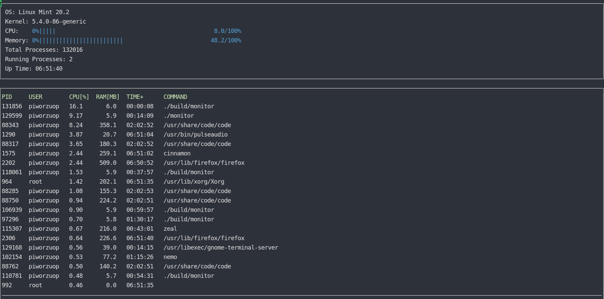

The System-Monitor program

This is a relatively simply System Monitor Program created as an examination assignment  in the Object Oriented Programming Course of the [Udacity C++ Nanodegree Program](https://www.udacity.com/course/c-plus-plus-nanodegree--nd213). 

The program works from the Linux terminal.

The program displays:
- the name of the operating system,
- the name of the Kernel,
- the overall CPU usage,
- the overal Memory usage,
- the total number of processes of the system,
- the number of currently running processes,
- the time of running of the system from the start (UpTime)
It also displays currently running processes sorted according to CPU usage.

The program could use further development, but it was made for educational purposes mainly, and as for now the further development is witheld, as spend most of my time in continuous programming learning curve.

## ncurses
[ncurses](https://www.gnu.org/software/ncurses/) is a library that facilitates text-based graphical output in the terminal. This project relies on ncurses for display output.

For running it might be necessary to install ncurses within your own Linux environment: `sudo apt install libncurses5-dev libncursesw5-dev` (although is highly likely that it is already installed on your Linux machine).

## Make
This project uses [Make](https://www.gnu.org/software/make/). The Makefile has four targets:
* `build` compiles the source code and generates an executable
* `format` applies [ClangFormat](https://clang.llvm.org/docs/ClangFormat.html) to style the source code
* `debug` compiles the source code and generates an executable, including debugging symbols
* `clean` deletes the `build/` directory, including all of the build artifacts

## Instructions

1. Clone the project repository: `git clone https://github.com/mBialczak/System-Monitor-Project.git`

2. Build the project: `make build`

3. Run the resulting executable: `./build/monitor`
